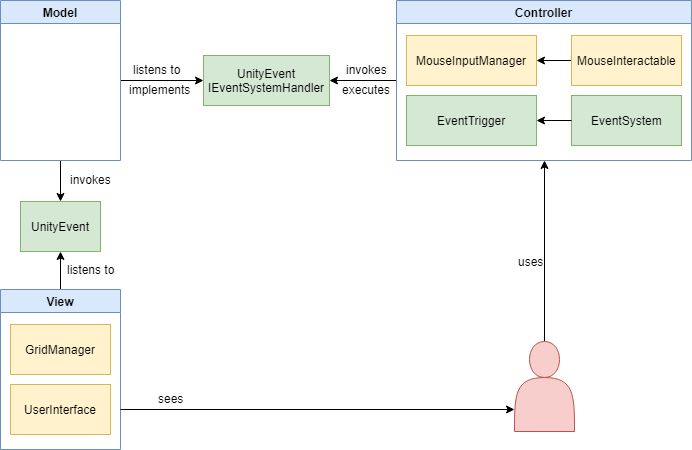

# PROJECT Design Documentation
> The following template provides the headings for your Design Documentation.  As you edit each section make sure you remove these commentary 'blockquotes'; the lines that start with a > character.

## Team Information
* Team name: **TEAM-AWESOME**
* Team members:
  * Haoyu Guo
  * Jeff Bauer
  * Ollyting Xin
  * Yiyan Wang
  * Zheyu Zhang

## Executive Summary
### Purpose
- Statement about the project: To create a casual strategy, stealth card game which can be taken beyond class as well as to improve our teammates' code, art and teamwork skills during the process. 
- User group: The most important user group as our target user are players who love strategy stealth games and cards game no matter they have much time to play or not.
- User goals: can enjoy the fun of the casual strategy stealth card game even when don't have too much time for entertainment. Easy to play and get access to the game on iOS/Android.  

### Glossary and Acronyms
| Term | Definition |
|------|------------|
| Map | A region or scene that players have to explore |
| Object | Anything in the map |
| Attribute | A nuimerical value representing objects' characteristics |
| Tile | A unit squared space in maps |
| Turn | A time period when either player character or computer-controled units can take actions |
| Phase | A specfic time in each turn when cards can take effect and player character can perform different actions |
| Start Phase (SP) | The beginning of each turn when some cards can take effect |
| Action Phase (AP) | The time in each turn when player character can move and use cards |
| End Phase (EP) | The end of each turn when some cards can take effect |
| Hand | All cards that player have |
| Strategy Card | A card that enables the player to perform special actions that are not available in regular game play |
| Enhancement Card | A card that can modify the attributes or status of units and other cards |
| Combat Card | A card that directly deals damages to units and objects or gives player character abilities to do so |

### Business Plan
**Mecahnics & Story Refinement**:
  * Refine mechanics
  * Refine story
  
**Development Flow**:
  * Info
  
**Alpha**:
  * Info
  
**Beta**:
  * Info
  
**Release**:
  * Info

## Requirements
### Features
* **Main Menu**: The first interactable screen that users will encounter
* **Player Character**: The player's avatar
  * **Attribute**: A numerical value representing character's ability
    * **Action Point**: A value determining how many grids can the character move in a map
  * **Shader**: The player character applied with a shader which makes it can be visible through walls/obstacles.
* **Level**: A map
  * **Obstacle**: An object that is able to block the way of other objects
    * **Wall**
    * **Tree**
    * **Shrub**
    * **Cage**
    * ...
  * **Enemy**: A Hostile creature that is generally controlled by artifical intelligence to stop players
    * **Guard**: A humanlike creature that detects invaders and fight against them
  * **The Interactible**: An object that players can interact with
    * **Save Point**: A special tile in the level that allows players to save their progression
* **User Interface**: A space on screen to demonstrate the status of the game and for players to interact
  * **Character Cultivation**: An user interface that allows players to nurture their character
  * **Level Selection**: An user interface that allows players to choose the level they want to play
* **Camera**: To provide the player with efficient parts of the game environment
* **Audio**: Different sounds to give the player an engaging gaming experience
  * **BGM**: To improve the immerse feeling of the level
  * **SFX**: To provide the player more interesting and real gaming experience

### Non-functional Requirements
| NFRs |  Technical Constraints |
|------|------------------------|
| Maintainability | The ability to detect issues in codes and be able to solve those bugs after being released|
| Localization | The skill of understanding and using languages |
| Readability | Good coding habit of each team member which adding proper comments to certain important parts of the codes |
| Controllability | Smooth experience under limited input varieties (tapping / focusing / dragging) |

## Domain
### Summary
This section describes the application domain.

The domain contains 5 large entities (colored in red) which are player, map, tile, turn, and card. Besides those 5 entities, there are other smaller related entities which are grouped by their color.

### Player
The player defines the character controlled by the person who is playing the game. It can be viewed as an avatar of the actual person. People who are playing the game have to control this character to explore the map to achieve certain goals to win. In the game, the player character will take up exactly one tile in the map and can move and use cards to strive for the win.

### Map
The map defines a small region or scene which player must explore in the game. It is essential to the game because player’s objective is to overcome difficulties in the map in order to achieve some goals. There are 3 types of entities (colored in blue) including enemy, obstacle, and interactable object that may show in the map. Obstacles include walls and boxes which can block the way which the player may want to go. Enemies are hostile creatures acting like guardians that may attack and kill the player. Interactive objects include treasure cases and traps which player can interact with to utilize in order to achieve the goals.

### Tile
The tile defines a squared space in the map that can be taken up by player, obstacles, objects, and enemy. Also, both the movement of the player and enemies and the range of card effect will take measured in tiles.

### Turn
The turn defines the basic time unit of the game. Both the player and enemies have to move or do things turn by turn. Each turn consists of exactly 6 phases (colored in yellow) which are standby phase, draw phase, move phase 1, action phase, move phase 2, and end phase. The player can draw 1 card in DP, move in MP1 and MP2 and use cards in AP.

### Card
The card is a item which the player can use to facilitate the exploration. It can be gained both at the beginning of entering any maps and during exploration by beating enemy or getting loots from treasures in the map. There are 3 types of card (colored in green) which are strategy card, enhancement card, and combat card. Strategy card can allow the player to play strategically against the environment. Enhancement card can enhance the player itself or other cards. Combat card will enable the player to attack enemies or obstacles. All those cards play important roles in the game because they help player overcome difficulties which cannot be dealt only by player itself.

## Architecture
### Summary
The following model shows a high-level view of the game's architecture.

The architecture consists of 3 major layers which are I/O, Unity API, and game logic. We choose this architecture over other alternatives because Unity is suitable for mobile game development and Unity is a supportive game engine which has a thriving community. Mobile games are not requiring the most proeminent techniques of graphic rendering which other common engines such as Unreal Engine 4 usually provide. In contrast to those engines, Unity has in-built graphic setting for mobile platforms. Also, there are tons of forums out there where Unity fans unite. There are resouces online in Unity asset store which are made by other developers that may help us during development. The in-built Unity API and tools will do a great help for us to develop our own game. Therefore, we don’t need to pay attention to the low-level actuation of the game. Besides, some members of our group have Unity developing experience before. Using Unity and the architecture based on that will make us go more smoothly in developing our game.

### I/O
The I/O layer contains three components that serve the function of generating game output and receiving player’s inputs. For our game, outputs just consist of graphic displays and sounds while inputs can be collected from both the display (the screen) and special input devices such as a keyboard.

#### Display
The display is a component that delivers visual output to players on the screen. The player-used device will read data from Unity graphic engine and then converts the data into visible pixels onto the screen. The display is also taking user inputs by delivering the click information to the Unity engine.

#### Sound
Sound is a component that delivers audio output to players. The player-used device will receive the processed sound data from Unity sound engine and play it as sound clips. The programmer can write scripts to control the sound according to the gameplay and story so that player can hear the sound when we want them to.

#### Input Device
A input device is used by players to generate user inputs in forms other than clicking on the screen. A possible device can be generally used is a keyboard.

### Unity API
The Unity API is a set of methods that Unity provides for us to handle the correct delivery of game contents.

#### Unity Sound
The Unity sound engine is a set of methods that can be used to produce and modify sounds. Unity has in-built programs that can handle the sound effects embedded in the game and have the capability to perform calculations on sound with CPU. Abstraction APIs, such as Open-AL, SDL Audio, X-Audio 2, Web Audio, etc. are also be available within this engine.

#### Unity Graphics\Physics
On the one hand, the Unity graphics engine is in charge of visual output. Several APIs are provided for programmers to take control of the graphics on their own. To put simply, it is a set of tools that programmers can use to easily show scenes and effects to their uses. Oh the other hand, the Unity physics engine handles the movement of objects and does mathmatic calculations to simulate real physical movements. Along with the graphic engine, it produces 3D animated visual outputs for the game.

#### Unity User interface
Unity UI offers a bunch of tools for designing user interface such as canvas, button, image, text, etc. It also contains systems that allow our own program to make communications between user interfaces and game logic or game data.

### Game Logic
The game logic is the programming focus of the team. Technically, it is a main loop what will continue looping when the game is played to make program decisions according to different situations. All necessary logics to handle user inputs, manipulate memorized data, and deliver program outputs are formed in this loop.

## Detailed Design
### Map Configuration File
* **Name**: The map's name
* **Width**: How wide the map is
* **Tiles**: List of tile ids for each position in the map
* **Max Turns**: Number of turns until map attempts to end game quickly
* **Spawns**: List of entities and their spawn positions
  * **ID**: The id of the entity being spawned
    * **1**: Player
    * **2**: Enemy
  * **Spawn Position**: Position that entity will spawn

### UI

The overall architecture of the UI system features a model-view-controller framework. Event-driven programming is used to realize the communication between components.

#### Grid
We applied a Grid Manager system to manage all the tile data in the actual level. Every single tile of the map can utilize by enemy detection range, card effect range, and player movement range.

This system works all the render and accessible area range highlight. Besides, all the unit position is holding by the grid position (x,y) instead of Unity world position.

#### User Interface
All UI displays are controlled by separated scripts. All actual UI classes are inherited from a parent class which is managed by a manager. All UI elements (Text, Image, Button, etc.) in one display are built into a single prefab which will be loaded by the manager when the display is going to be shown.

## Issues and Risks
* The reliability of Enemy AI could be one of the main factors will impact the user experience. To make the game not too easy or too       hard, we need to adjust enemy intelligence very carefully.
* The diversity of the cards is one of another issue. If we don't have enough compelling card, there is no power to attract customers.
* The length of each play session may limited the scale of map size and also effect the actual oppotunity of using cards in game.
